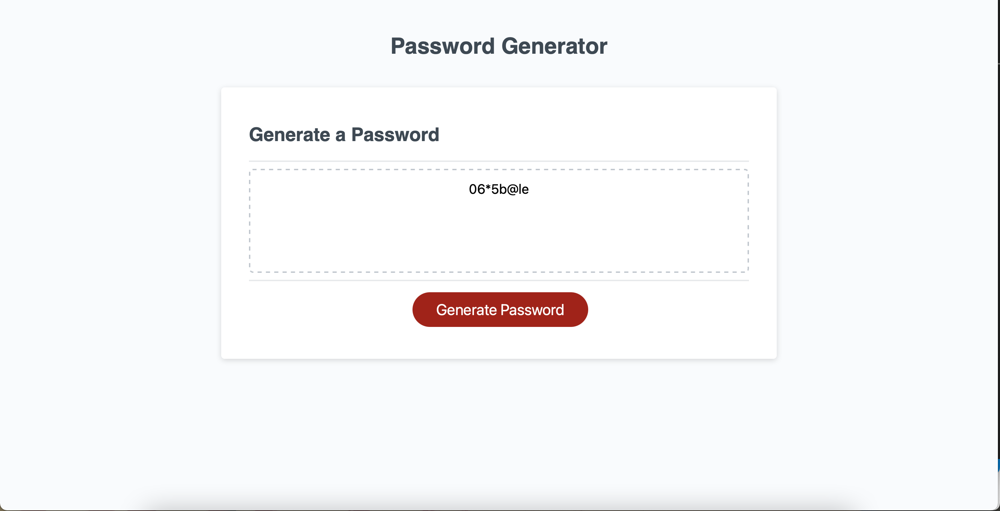

# password-generator

## Description
This application is designed to generate a random pasword based on selected criteria. The app runs in the browser and uses JavaScript to allow the user to interact with the application. Users can pick a length between 8 and 128 and select which types of characters they want in their password and the generatePassword function will create a random password out of those criteria. 

## Links

- GitHub pages: https://mayalorimer.github.io/password-generator/
- GitHub repository: https://github.com/mayalorimer/password-generator 

## Technologies Used
- HTML
- JavaScript
- CSS

## Screenshot 
